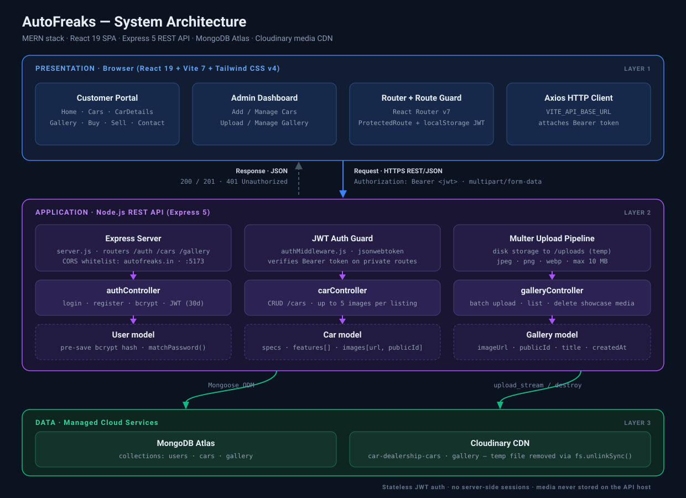
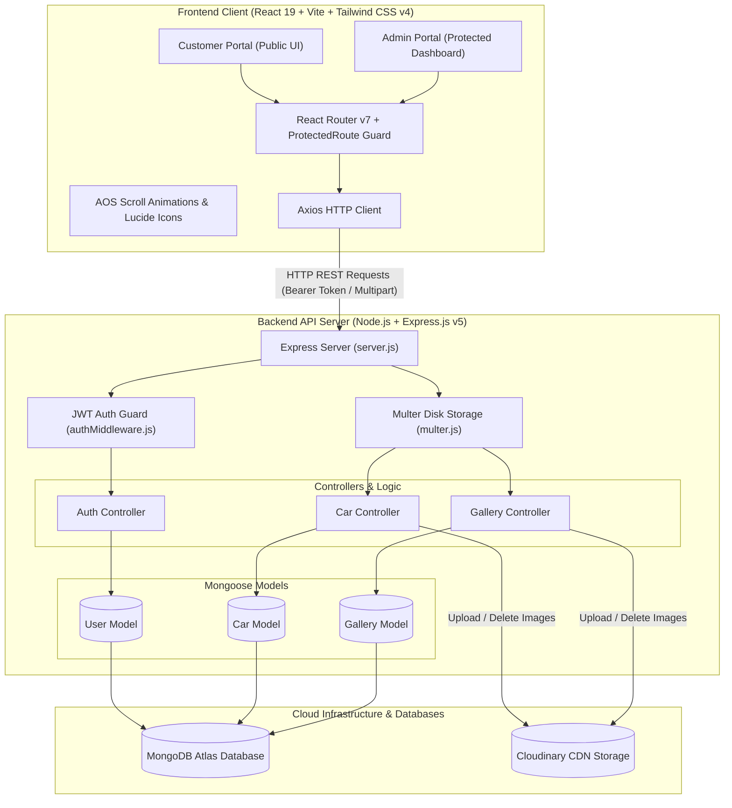
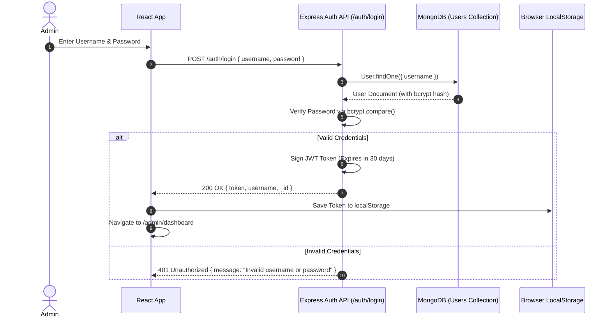
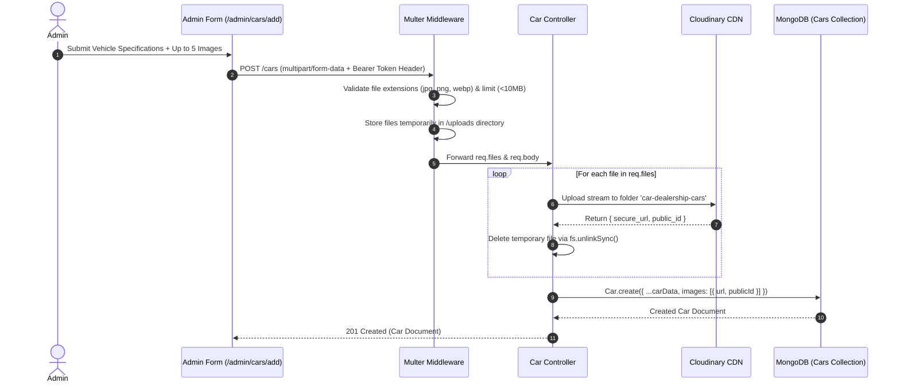

# 🚗 AutoFreaks - Premium Car Dealership Platform Architecture

[](https://react.dev/)
[](https://vitejs.dev/)
[](https://tailwindcss.com/)
[](https://nodejs.org/)
[](https://www.mongodb.com/)
[](https://cloudinary.com/)

**AutoFreaks** is a full-stack (MERN) platform designed for showcasing, buying, selling, and managing luxury pre-owned cars. It features a public-facing customer portal with scroll animations and image galleries, alongside a secure, cloud-backed Admin Dashboard for inventory and media management.

---

## 📑 Table of Contents
- [🏗️ High-Level System Architecture](#️-high-level-system-architecture)
- [🔄 Core Architectural Data Flows](#-core-architectural-data-flows)
  - [1. Authentication & JWT Session Flow](#1-authentication--jwt-session-flow)
  - [2. Multi-Image Upload & Inventory Pipeline](#2-multi-image-upload--inventory-pipeline)
- [🗄️ Database Schemas & Data Models](#️-database-schemas--data-models)
  - [1. Car Model](#1-car-model-schema-modelscarjs)
  - [2. Gallery Model](#2-gallery-model-schema-modelsgalleryjs)
  - [3. User Model](#3-user-model-schema-modelsuserjs)
- [🔌 API Endpoint Specifications](#-api-endpoint-specifications)
- [🖥️ Directory Structure & Component Architecture](#️-directory-structure--component-architecture)
- [🛠️ Technology Stack Matrix](#️-technology-stack-matrix)
- [🔒 Security & Middleware Architecture](#-security--middleware-architecture)
- [⚙️ Environment Setup & Local Installation](#️-environment-setup--local-installation)

---

## 🏗️ High-Level System Architecture

<p align="center">
  
</p>

The platform is split into three layers. The **React SPA** serves both the public showroom and the protected admin console, attaching a JWT to every privileged request. The **Express 5 API** authenticates that token, streams uploaded files through Multer, and delegates to controllers that own one resource each. **MongoDB Atlas** stores records while **Cloudinary** stores media — the API host keeps no persistent files, so it can be redeployed or scaled without losing images.

<details>
<summary><b>Component-level diagram (Mermaid source)</b></summary>



</details>

---

## 🔄 Core Architectural Data Flows

### 1. Authentication & JWT Session Flow


### 2. Multi-Image Upload & Inventory Pipeline


---

## 🗄️ Database Schemas & Data Models

### 1. `Car` Model Schema (`models/Car.js`)
Stores full specification records and Cloudinary image asset details for vehicles.

| Field | Type | Required | Default | Description |
| :--- | :--- | :--- | :--- | :--- |
| `name` | `String` | Yes | - | Model & trim name (e.g. "Mercedes Benz E-Class") |
| `brand` | `String` | Yes | - | Vehicle brand (e.g. "Mercedes Benz", "BMW") |
| `year` | `String` | Yes | - | Model year / registration format (e.g. "2020/21") |
| `price` | `Number` | No | `null` | Vehicle price in INR (`null` displays "Contact for Price") |
| `kms` | `String` | Yes | - | Distance driven (e.g. "24,000 KMS") |
| `variant` | `String` | Yes | - | Engine / trim variant specification |
| `colour` | `String` | Yes | - | Exterior color finish |
| `transmission` | `String` | Yes | - | Transmission type (Automatic / Manual) |
| `fuel` | `String` | Yes | - | Fuel type (Petrol / Diesel / Electric / Hybrid) |
| `owner` | `String` | Yes | - | Ownership history (1st Owner, 2nd Owner) |
| `insurance` | `String` | No | `'Valid'` | Insurance validity status |
| `registration` | `String` | Yes | - | State registration / RTO code (e.g. "MH-02") |
| `description` | `String` | Yes | - | Rich description text |
| `features` | `[String]` | No | `[]` | Array of vehicle feature highlights |
| `engine` | `String` | No | - | Engine displacement (e.g. "2.0L Turbo Diesel") |
| `maxPower` | `String` | No | - | Maximum power rating (e.g. "194 bhp") |
| `maxTorque` | `String` | No | - | Peak torque rating (e.g. "400 Nm") |
| `images` | `[Object]` | Yes | `[]` | Array of objects: `{ url: String, publicId: String }` |
| `createdAt` | `Date` | No | `Date.now` | Record creation timestamp |

---

### 2. `Gallery` Model Schema (`models/Gallery.js`)
Stores media records for delivery celebrations and showroom showcases.

| Field | Type | Required | Default | Description |
| :--- | :--- | :--- | :--- | :--- |
| `imageUrl` | `String` | Yes | - | Hosted Cloudinary image URL |
| `publicId` | `String` | Yes | - | Cloudinary public asset ID (used for cloud deletion) |
| `title` | `String` | No | `""` | Optional image title / customer name |
| `createdAt` | `Date` | No | `Date.now` | Upload timestamp |

---

### 3. `User` Model Schema (`models/User.js`)
Admin authorization and credentials model.

| Field | Type | Constraints | Description |
| :--- | :--- | :--- | :--- |
| `username` | `String` | `required: true, unique: true` | Admin username |
| `password` | `String` | `required: true` | Password hash created via `bcrypt.hash` pre-save hook |

**Pre-save Logic & Instance Methods:**
- **Pre-save Hook**: Hashes modified password field with 10 salt rounds (`bcrypt.genSalt(10)`).
- **`matchPassword(enteredPassword)`**: Compares input password against stored hash asynchronously.

---

## 🔌 API Endpoint Specifications

### 🔑 Authentication Routes (`/auth`)

| Endpoint | Method | Access | Description | Request Body |
| :--- | :--- | :--- | :--- | :--- |
| `/auth/login` | `POST` | Public | Authenticates admin credentials and returns JWT token | `{ "username": "admin", "password": "..." }` |
| `/auth/register`| `POST` | Public (Helper) | Creates a new admin account with hashed password | `{ "username": "admin", "password": "..." }` |

### 🏎️ Vehicle Inventory Routes (`/cars`)

| Endpoint | Method | Access | Description | Request Payload / Parameters |
| :--- | :--- | :--- | :--- | :--- |
| `/cars` | `GET` | Public | Fetch all cars sorted by newest (`createdAt: -1`) | None |
| `/cars/:id` | `GET` | Public | Fetch single car details by MongoDB ObjectId | Param: `:id` |
| `/cars` | `POST` | Private (Admin) | Add a new car listing + upload up to 5 images | `multipart/form-data` (`images`, text fields) |
| `/cars/:id` | `PUT` | Private (Admin) | Update vehicle specifications and add/delete images | `multipart/form-data`, Param: `:id` |
| `/cars/:id` | `DELETE` | Private (Admin) | Deletes car record and removes images from Cloudinary | Param: `:id` |

### 🖼️ Showcase Gallery Routes (`/gallery`)

| Endpoint | Method | Access | Description | Request Payload / Parameters |
| :--- | :--- | :--- | :--- | :--- |
| `/gallery` | `GET` | Public | Fetch all gallery showcase images | None |
| `/gallery/upload`| `POST` | Private (Admin) | Batch upload images to Cloudinary & Gallery DB | `multipart/form-data` (`images`) |
| `/gallery/:id` | `DELETE` | Private (Admin) | Deletes gallery image from DB & Cloudinary CDN | Param: `:id` |

---

## 🖥️ Directory Structure & Component Architecture

```
car-dealership/
├── client/                      # React 19 Frontend (Vite + Tailwind CSS v4)
│   ├── public/                  # Favicons & Static Public Assets
│   ├── src/
│   │   ├── assets/              # Luxury Brand Logos & Fallback Assets
│   │   ├── components/          # Reusable UI & Layout Components
│   │   │   ├── Brands.jsx       # Luxury Brand Logos Showcase Grid
│   │   │   ├── FloatingContact.jsx # Floating Quick Call / WhatsApp Actions
│   │   │   ├── Footer.jsx       # Global Footer Component
│   │   │   ├── Navbar.jsx       # Responsive Glassmorphic Navigation Bar
│   │   │   ├── ProtectedRoute.jsx # Route Guard validating JWT in localStorage
│   │   │   ├── ScrollToTop.jsx  # Automatic Scroll Position Reset on Route Change
│   │   │   └── Testimonials.jsx # Customer Testimonial Carousel
│   │   ├── pages/               # Public & Admin Page Views
│   │   │   ├── About.jsx        # Dealership Story & Information
│   │   │   ├── BuyCar.jsx       # Buyer Inquiry Portal
│   │   │   ├── CarDetails.jsx   # Vehicle Detail Specification Sheet & Carousel
│   │   │   ├── Cars.jsx         # Inventory Catalog with Brand & Search Filtering
│   │   │   ├── Contact.jsx      # Direct Contact Form & Google Map Embed
│   │   │   ├── Gallery.jsx      # Customer Deliveries & Media Showcase
│   │   │   ├── Home.jsx         # Hero Landing Page with Scroll Animations
│   │   │   ├── SellCar.jsx      # Customer Vehicle Evaluation Request Form
│   │   │   └── admin/           # Protected Admin Control Panel Views
│   │   │       ├── AddCar.jsx         # Add Listing Form with Image Drag-and-Drop
│   │   │       ├── Dashboard.jsx      # Central Admin Management Portal
│   │   │       ├── Login.jsx          # Secure Admin Login Screen
│   │   │       ├── ManageCars.jsx     # Edit & Delete Vehicle Inventory
│   │   │       ├── ManageGallery.jsx  # Gallery Image Management
│   │   │       └── UploadGallery.jsx  # Batch Photo Upload to Gallery
│   │   ├── App.jsx              # Application Core Router & Preloader Screen
│   │   ├── main.jsx             # React DOM Mounting Root
│   │   └── index.css            # Tailwind 4 Directives & Dark Mode Styling
│   ├── package.json             # Frontend Dependencies
│   └── vite.config.js           # Vite Server & Build Settings
│
└── server/                      # Node.js + Express API Backend
    ├── config/                  # Server & Service Integrations
    │   ├── db.js                # MongoDB Mongoose Connection
    │   └── cloudinary.js        # Cloudinary SDK Configuration
    ├── controllers/             # Endpoint Controllers (Business Logic)
    │   ├── authController.js    # Admin JWT Login & Registration
    │   ├── carController.js     # Car CRUD Operations & Cloudinary Sync
    │   └── galleryController.js # Gallery CRUD & Batch Cloudinary Upload
    ├── middleware/              # Express Custom Middleware
    │   ├── authMiddleware.js    # Bearer Token JWT Authentication Guard
    │   └── multer.js            # Multipart Disk Storage Engine & Filtering
    ├── models/                  # Database Mongoose Schemas
    │   ├── Car.js               # Vehicle Record Schema
    │   ├── Gallery.js           # Gallery Image Schema
    │   └── User.js              # Admin User Credentials Schema
    ├── routes/                  # Express REST Router Definitions
    │   ├── auth.js              # Auth Routes (/auth)
    │   ├── cars.js              # Cars Routes (/cars)
    │   └── gallery.js           # Gallery Routes (/gallery)
    ├── seed.js                  # Initial Database Admin Seeder Script
    ├── server.js                # Express Application Entry Point
    └── package.json             # Backend Dependencies & Scripts
```

---

## 🛠️ Technology Stack Matrix

| Layer | Technology | Version | Purpose |
| :--- | :--- | :--- | :--- |
| **Frontend UI** | React | `19.2.0` | Component-driven user interface |
| **Build Tooling** | Vite | `7.2.4` | Lightning-fast development & bundling |
| **Routing** | React Router DOM | `7.10.1` | SPA Routing with Protected Layout Guards |
| **Styling** | Tailwind CSS | `4.1.18` | Utility-first CSS engine via `@tailwindcss/postcss` |
| **Animations** | AOS | `2.3.4` | Animate On Scroll visual transitions |
| **Icons** | Lucide React | `0.561.0` | Modern SVG iconography |
| **HTTP Client** | Axios | `1.13.2` | REST API communication |
| **Backend Runtime** | Node.js / Express | `Express 5.2.1` | REST API Web Server |
| **Database** | MongoDB Atlas / Mongoose | `Mongoose 9.0.1` | NoSQL Database & Schema Object Modeling |
| **Auth & Security** | JWT & BcryptJS | `jsonwebtoken 9.0`, `bcryptjs 3.0` | Token authorization & password hashing |
| **File Handling** | Multer | `2.0.2` | Multipart upload parsing and validation |
| **Cloud Storage** | Cloudinary | `2.8.0` | Image hosting CDN with automatic image optimization |

---

## 🔒 Security & Middleware Architecture

1. **Password Encryption**: Passwords are saved strictly as one-way salted hashes using `bcryptjs` with 10 salt rounds executed in `User.js` pre-save middleware.
2. **Stateless Authorization**: Protected endpoints verify incoming requests with `authMiddleware.js`. The token must be sent in the header as: `Authorization: Bearer <token>`.
3. **Automated Server Storage Cleanup**: Files uploaded via `multer` are stored in temporary local server storage (`/uploads`), streamed to Cloudinary CDN, and instantly deleted from local server disk using `fs.unlinkSync()`.
4. **Strict Media Validation**: `multer.js` restricts file uploads exclusively to `image/jpeg`, `image/jpg`, `image/png`, and `image/webp` with a strict file size limit of 10MB per file.
5. **CORS Security**: Cross-Origin Resource Sharing is controlled in `server.js` to whitelist trusted origins (`autofreaks.in` and `http://localhost:5173`).

---

## ⚙️ Environment Setup & Local Installation

### 1. Prerequisites
- **Node.js** v18.0.0 or higher
- **MongoDB** cluster connection string (MongoDB Atlas or local instance)
- **Cloudinary** account credentials

### 2. Environment Variables Setup

#### Backend (`server/.env`)
Create a `.env` file inside the `server/` directory:
```env
PORT=5000
MONGO_URI=mongodb+srv://<username>:<password>@cluster.mongodb.net/autofreaks?retryWrites=true&w=majority
JWT_SECRET=your_super_secret_jwt_key_here
CLOUDINARY_CLOUD_NAME=your_cloudinary_cloud_name
CLOUDINARY_API_KEY=your_cloudinary_api_key
CLOUDINARY_API_SECRET=your_cloudinary_api_secret
```

#### Frontend (`client/.env`)
Create a `.env` file inside the `client/` directory:
```env
VITE_API_BASE_URL=http://localhost:5000
```

### 3. Database Seeding (Admin User Creation)
Run the seeder script to populate an initial administrator account:
```bash
cd server
node seed.js
```
*Default Credentials Created:*
- **Username:** `admin`
- **Password:** `password123`

### 4. Running the Application

Open two separate terminals:

**Terminal 1: Start Backend API**
```bash
cd server
npm install
npm run start
```
*Backend API runs at: `http://localhost:5000`*

**Terminal 2: Start Frontend Application**
```bash
cd client
npm install
npm run dev
```
*Frontend runs at: `http://localhost:5173`*
